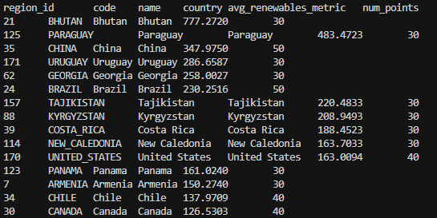
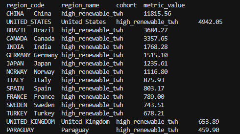
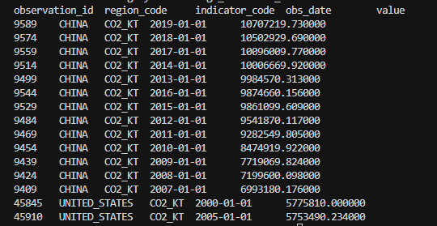

# Database Design — Renewable Energy Dashboard (CS 411 Stage 3)

Team: Team 94 HOA
Course / term: CS 411, Spring 2026
DBMS: MySQL 8.x (local)
Primary data: Kaggle — Global Data on Sustainable Energy

---

## Step 1 — Which dataset we chose (and why)

| Criterion | Global Data on Sustainable Energy (anshtanwar) | Global Energy Consumption (atharvasoundankar) |
|-----------|-------------------------------------------------|---------------------------------------------------|
| Fit to schema | Strong: one row per country × year with many numeric columns → maps cleanly to regions + indicators + observations (unpivot). Includes latitude/longitude for regions. | Weaker: only nine columns, no coordinates; country names may not match the first dataset (e.g. USA vs United States). |
| Ease of import | Wide CSV was reshaped into long-form observations offline; we ship the result as sql/generated_kaggle_data.sql (MySQL-only load). | Easier structurally, but duplicate (Country, Year) rows can appear in the raw file if you re-import yourself. |
| Row volume | ~3.6k rows × ~15 metrics ⇒ tens of thousands of observations after unpivot. | ~10k rows; fewer metrics per row. |
| Advanced queries | Rich mix: renewables %, TWh by source, CO₂, GDP, access — good for GROUP BY, UNION cohorts, correlated “vs country average” queries. | Useful as a second source (we add GEC_* indicators) but not enough alone for a full dashboard story. |

Decision: Use Sustainable Energy as the primary dataset. Our checked-in generated_kaggle_data.sql also includes rows from Global Energy Consumption where country names matched (with aliases like USA → United States).

---

## Step 2 — Data provenance

Load path: sql/generated_kaggle_data.sql (no extra tools). Optional copies of the raw Kaggle CSVs may live under data/ for citation only (data/README.md).

Original wide CSV (Sustainable Energy): Entity, Year, many numeric metric columns, Latitude, Longitude. GEC CSV: Country, Year, consumption and share columns. Those were unpivoted into indicators + observations before we froze the bulk SQL file. Indicator codes in the database include e.g. ELEC_RENEW_TWH, CO2_KT, RENEW_SHARE_TFEC_PCT, and prefixed GEC_* metrics from the second dataset.

---

## Step 3 — Mapping CSV → relational schema

| Our table | Source |
|-----------|--------|
| regions | Distinct Entity; code = slug from name (≤64 chars); name/country = Entity; latitude/longitude from first row seen for that entity. |
| indicators | One row per metric; code short stable key (e.g. ELEC_RENEW_TWH); unit/category/description set in the bulk load to match Kaggle semantics. |
| observations | One row per (region, indicator, year-01-01) with non-null numeric value; data_source string identifies the CSV; recorded_by_user_id = NULL. |

Minimal schema change: regions.code widened to VARCHAR(64) so long country names still produce unique codes after slugging.

Stage 3 “1000+ rows in three tables”: After load, users (1200 synthetic), observations (very large), and dashboard_regions (≥1200 link rows) each exceed 1000 rows. regions stays ~176 (real countries) — that is OK because the assignment counts three tables, not every table.

---

## Step 4 — Repo files (DDL + SQL + report)

| Path | Role |
|------|------|
| sql/schema.sql | Full DDL (eight tables). |
| sql/load_data.sql | MySQL SOURCE order for schema + data. |
| sql/generated_kaggle_data.sql | Bulk INSERTs (~5 MB): users, regions, indicators, observations, dashboards, links. |
| sql/queries.sql | Three advanced queries aligned to loaded data. |
| sql/indexes.sql | EXPLAIN ANALYZE + index experiments. |
| doc/Database Design.md | This writeup. |

## Step 5 — Advanced queries (summary)

All three are in sql/queries.sql with header comments. They use:

1. Uses Joins, GROUP BY and HAVING — renewable-category countries above global average (2010–2019).
2. Uses UNION, joins, GROUP BY and SUM / COUNT(DISTINCT) — high cumulative renewable TWh vs many distinct metrics.
3. Joins and subquery — CO₂ years above that country’s long-run average on the same indicator.

---

## Step 6 — Indexing analysis (what to screenshot)

Run sections of sql/indexes.sql after data is loaded. For each of the three queries:

1. Capture baseline EXPLAIN ANALYZE (cost from plan).
2. Add three secondary indexes (not PK/unique), EXPLAIN ANALYZE after each, then DROP INDEX before the next design on the same table.
3. Write one paragraph per query comparing costs; explain tradeoffs (e.g. faster SELECT vs slower bulk load).

Suggested final indexes (team choice after measuring): We chose the indexes that resulted in the fastest query execution time for each of the 3 queries we tested. 

Screenshot placeholders

> 
> 
> (repeat for designs B, C and for Queries 2–3)

> 
> 
> 

