# Database Design — Renewable Energy Dashboard (CS 411 Stage 3)

**Team:** Team 94 HOA  
**Course / Term:** CS 411, Spring 2026  
**DBMS:** MySQL 8.x (local)  
**Primary Data:** Kaggle — *Global Data on Sustainable Energy*

---

## Step 1 — Dataset Choice and Why We Chose It

For this project, we looked at two datasets: **Global Data on Sustainable Energy** and **Global Energy Consumption**. After comparing both, we decided to use **Global Data on Sustainable Energy** as our main dataset because it fit our schema better and had more useful attributes for advanced queries.

| Criterion | Global Data on Sustainable Energy | Global Energy Consumption |
|-----------|----------------------------------|----------------------------|
| Fit to schema | Strong fit because it has one row per country and year with many numeric columns. This maps well to our `regions`, `indicators`, and `observations` tables. | Weaker fit because it has fewer columns and no location data. |
| Ease of import | Required reshaping from wide format into long-form observations. | Easier structure but had some possible duplicate `(Country, Year)` rows. |
| Row volume | Around 3.6k rows with many metrics, which becomes tens of thousands of rows after transformation. | Around 10k rows but fewer useful metrics. |
| Query support | Includes renewable share, electricity generation, CO₂ emissions, GDP, and access to electricity, which helped with advanced queries. | Useful as a secondary source but not enough by itself. |

We decided to use **Global Data on Sustainable Energy** as the primary dataset. We also included matching rows from the second dataset when country names lined up, such as `USA` and `United States`.

---

## Step 2 — Data Source and Processing

The main load file for our project is **`sql/generated_kaggle_data.sql`**.

The original CSV from Kaggle includes columns like `Entity`, `Year`, several renewable energy and emissions metrics, and `Latitude` / `Longitude`.

Before loading the data into MySQL, we converted the wide CSV format into the relational structure used by our database. This mainly involved separating the data into `indicators` and `observations`.

Some example indicator codes used in our database are:

- `ELEC_RENEW_TWH`
- `CO2_KT`
- `RENEW_SHARE_TFEC_PCT`

We also included some `GEC_*` metrics from the second dataset.

---

## Step 3 — How the CSV Maps to Our Tables

We implement **more than five** main relational tables. The **five core** tables for the energy story are: **`users`** (accounts), **`regions`**, **`indicators`**, **`observations`** (fact table), and **`dashboards`**. We also use three junction / link tables: **`user_saved_dashboards`**, **`dashboard_regions`**, and **`dashboard_indicators`**.

| Table | Description |
|------|-------------|
| `users` | Dashboard owners and roles |
| `regions` | Country or region names, codes, and coordinates |
| `indicators` | Each metric (renewable share, CO₂, etc.) |
| `observations` | Fact rows: one value per `(region, indicator, date)` |
| `dashboards` | Saved dashboard definitions per user |
| `user_saved_dashboards` | Which users bookmarked which dashboards |
| `dashboard_regions` | Regions attached to a dashboard |
| `dashboard_indicators` | Indicators attached to a dashboard |

For `regions`, we used the distinct `Entity` values from the dataset. For `indicators`, each measurable metric became its own row with a short code. For `observations`, each row stores one `(region, indicator, date)` value.

One small change we made was increasing `regions.code` to `VARCHAR(64)` so longer country names would still fit.

For the requirement of having **1000+ rows in at least three tables**, our database meets this with **`users`**, **`observations`**, and **`dashboard_regions`** (see `COUNT(*)` screenshots in Step 7).

---

## Step 4 — Important Files in the Repo

Paths below are relative to the **repository root**.

| File | Purpose |
|------|---------|
| `sql/schema.sql` | `CREATE TABLE` DDL for all eight tables |
| `sql/load_data.sql` | How to `SOURCE` schema + bulk data in MySQL |
| `sql/generated_kaggle_data.sql` | Bulk `INSERT` statements (large file) |
| `sql/queries.sql` | Three advanced queries for the application |
| `sql/indexes.sql` | `EXPLAIN ANALYZE` + experimental `CREATE INDEX` / `DROP INDEX` |
| `doc/Database Design.md` | This write-up |

---

## Step 5 — Advanced Queries (summary + full SQL)

We created three advanced SQL queries for the dashboard. Each uses **at least two** of: joins across multiple tables, `UNION`, `GROUP BY` / `HAVING` aggregation, and a **subquery** (scalar subquery in `HAVING`, or a **correlated** subquery in `WHERE`).

### Query 1 — Countries above the global renewable average (2010–2019)

**Concepts:** joins (`observations`, `regions`, `indicators`), `GROUP BY`, `HAVING`, scalar subquery comparing each country’s average to the **global** average.

```sql
SELECT 
    r.region_id,
    r.code,
    r.name,
    r.country,
    ROUND(AVG(o.value), 4) AS avg_renewables_metric,
    COUNT(*) AS num_points
FROM observations AS o
JOIN regions AS r ON r.region_id = o.region_id
JOIN indicators AS i ON i.indicator_id = o.indicator_id
WHERE i.category = 'Renewables'
  AND o.obs_date BETWEEN '2010-01-01' AND '2019-01-01'
GROUP BY r.region_id, r.code, r.name, r.country
HAVING AVG(o.value) > (
    SELECT AVG(o2.value)
    FROM observations AS o2
    JOIN indicators AS i2 ON i2.indicator_id = o2.indicator_id
    WHERE i2.category = 'Renewables'
      AND o2.obs_date BETWEEN '2010-01-01' AND '2019-01-01'
)
ORDER BY avg_renewables_metric DESC
LIMIT 15;
```

### Query 2 — High renewable TWh or broad metric coverage

**Concepts:** `UNION` of two cohorts, joins, `GROUP BY`, `SUM`, `COUNT(DISTINCT)`, `HAVING`.

```sql
(
    SELECT 
        r.code AS region_code,
        r.name AS region_name,
        'high_renewable_twh' AS cohort,
        ROUND(SUM(o.value), 2) AS metric_value
    FROM observations AS o
    JOIN regions AS r ON r.region_id = o.region_id
    JOIN indicators AS i ON i.indicator_id = o.indicator_id
    WHERE i.code = 'ELEC_RENEW_TWH'
      AND o.obs_date BETWEEN '2012-01-01' AND '2019-01-01'
    GROUP BY r.region_id, r.code, r.name
    HAVING SUM(o.value) > 100
)
UNION
(
    SELECT 
        r.code,
        r.name,
        'many_metrics',
        CAST(COUNT(DISTINCT o.indicator_id) AS DECIMAL(18, 2))
    FROM observations AS o
    JOIN regions AS r ON r.region_id = o.region_id
    WHERE o.obs_date BETWEEN '2005-01-01' AND '2015-01-01'
    GROUP BY r.region_id, r.code, r.name
    HAVING COUNT(DISTINCT o.indicator_id) >= 12
)
ORDER BY cohort, metric_value DESC
LIMIT 15;
```

### Query 3 — CO₂ years above that country’s long-run average

**Concepts:** joins, **correlated** subquery (`AVG` per `region_id` / `indicator_id` in the `WHERE` clause).

```sql
SELECT 
    o.observation_id,
    r.code AS region_code,
    i.code AS indicator_code,
    o.obs_date,
    o.value
FROM observations AS o
JOIN regions AS r ON r.region_id = o.region_id
JOIN indicators AS i ON i.indicator_id = o.indicator_id
WHERE i.code = 'CO2_KT'
  AND o.obs_date BETWEEN '2000-01-01' AND '2019-01-01'
  AND o.value > (
        SELECT AVG(o2.value)
        FROM observations AS o2
        WHERE o2.region_id = o.region_id
          AND o2.indicator_id = o.indicator_id
          AND o2.obs_date BETWEEN '2000-01-01' AND '2015-01-01'
)
ORDER BY o.value DESC
LIMIT 15;
```

Each query ends with `LIMIT 15` for the result screenshots. If a run ever returns fewer than 15 rows, note the actual count in the submission.

---

## Step 6 — Indexing analysis (`EXPLAIN ANALYZE`)

### How we measure performance

We use MySQL **`EXPLAIN ANALYZE`** as scripted in `sql/indexes.sql`. The course emphasizes comparing **optimizer-estimated cost** (`cost=` on plan nodes), not only wall-clock `actual time`, because timing can vary between runs. We compare the **same query** across: **baseline** (no experimental indexes) and **three secondary index designs** each named `idx_stage3_*`. After each trial we **`DROP INDEX`** so the next design is measured fairly.

**Tradeoffs:** Every non-primary secondary index speeds specific read plans but adds **storage** and **write/maintenance** cost on `INSERT`/`UPDATE`/`DELETE` and bulk reloads. We only recommend keeping indexes that clearly help the analytics queries we care about.

### True baseline vs “before indexing” (Query 1 and all queries)

After `sql/schema.sql` and `sql/generated_kaggle_data.sql`, the database already has **primary keys**, **foreign keys**, and **unique** constraints (including **`uq_observations_grain`** on `(region_id, indicator_id, obs_date)`). Those uniqueness constraints create indexes in InnoDB. So the **baseline is not “no indexes at all”** — it means **no extra `idx_stage3_*` experimental indexes** from `sql/indexes.sql`.

**If `q1_before.png` (or any baseline screenshot) was captured after a partial run of `sql/indexes.sql`,** the plan might already show an experimental index (e.g. `idx_stage3_q1_a_obs_ind_date`). That would **not** be a valid baseline.

**To regenerate a true baseline for Query 1 (and similarly for Queries 2–3 before their baselines):**

1. In MySQL, run:
   - `SHOW INDEX FROM observations WHERE Key_name LIKE 'idx_stage3_%';`
   - `SHOW INDEX FROM indicators WHERE Key_name LIKE 'idx_stage3_%';`
2. For every `idx_stage3_*` row returned, run `DROP INDEX index_name ON table_name;` (use the exact names shown).
3. Run **only** the first `EXPLAIN ANALYZE` block for that query in `sql/indexes.sql` (the block labeled baseline).

Canonical SQL for Query 1 baseline is the first `EXPLAIN ANALYZE` under “QUERY 1” in `sql/indexes.sql`.

---

### Query 1 — indexing analysis (renewable average vs global benchmark)

**What the query does:** It restricts to **Renewables** category indicators and years **2010–2019**, computes each country’s **average** metric value, and keeps only countries whose average **exceeds** the **global** average over the same window (implemented as a scalar subquery in `HAVING`). Results are sorted and limited to 15 rows.

**Advanced SQL used:** Multi-table **joins**, **`GROUP BY` / `HAVING`**, and a **scalar subquery** that is not equivalent to a simple extra join because it aggregates the **entire** population for the comparison threshold.

**Baseline (`q1_before.png`):** With only PK/unique/FK indexes, the optimizer typically uses **nested loops** and lookups on **`uq_observations_grain`** and dimension tables. The plan often does more work scanning or probing **`observations`** for the date/category filter than necessary; the **root `Limit` / `Sort`** node carries a **higher estimated cost** than in the best secondary-index plans (compare `cost=` in the screenshot).

**Design 1 — `idx_stage3_q1_a_obs_ind_date` on `observations (indicator_id, obs_date)` (`q1_design1.png`):** Matches how we filter facts: **indicator** (via join to `indicators`) plus **observation date** range. This usually **reduces cost** on both the outer aggregation and the subquery’s scan of `o2`, because the engine can **range-scan** observations by indicator and date instead of relying only on the grain unique index. **Tradeoff:** Larger secondary index on the biggest table; bulk reloads get slightly slower.

**Design 2 — `idx_stage3_q1_b_obs_date_ind` on `observations (obs_date, indicator_id)` (`q1_design2.png`):** Puts **date first**. For our query, category membership is determined through **`indicators`**, so leading with `obs_date` alone is often **less selective** early in the plan than `(indicator_id, obs_date)`. In our runs this design was typically **worse than Design 1** or only **marginally better than baseline** — compare `cost=` on the same operators to Design 1. **Tradeoff:** Similar maintenance cost as Design 1 with weaker alignment to the join order.

**Design 3 — `idx_stage3_q1_c_ind_cat_code` on `indicators (category, code)` (`q1_design3.png`):** Speeds **`WHERE i.category = 'Renewables'`** by indexing the dimension. This can **lower cost** on **`indicators`** access and sometimes the join into `observations`, but it **does not replace** a good access path on **`observations`**. Total plan cost may **improve vs baseline** but **not beat Design 1** alone if the fact table remains the bottleneck.

**Final choice for Query 1:** **`idx_stage3_q1_a_obs_ind_date`** — best match to predicates on **`observations`** for both the outer query and the subquery, and typically the **largest cost reduction** vs baseline in our `EXPLAIN ANALYZE` screenshots.

---

### Query 2 — indexing analysis (`UNION` cohorts)

**What the query does:** The first branch finds regions with **high cumulative** `ELEC_RENEW_TWH` in 2012–2019; the second finds regions with **many distinct indicators** in 2005–2015. The two result sets are combined with **`UNION`**, then sorted and limited to 15 rows.

**Advanced SQL used:** **`UNION`**, **joins**, **`GROUP BY`**, **`SUM` / `COUNT(DISTINCT)`**, **`HAVING`**.

**Baseline (`q2_before.png`):** Without `idx_stage3_*`, both branches often scan or loop **`regions`** and **`observations`** heavily; the **union materialization** and **sort** show **substantial cost** on the top-level operators.

**Design 1 — `idx_stage3_q2_a_obs_ind_date` on `observations (indicator_id, obs_date)` (`q2_design1.png`):** Optimizes the **first branch** (fixed `ELEC_RENEW_TWH` + date range). Cost on that branch usually **improves clearly**. The **second branch** (no indicator filter in `WHERE`) may see **little benefit**, so **overall union cost may only drop moderately**. **Tradeoff:** Skews benefit toward one half of the `UNION`.

**Design 2 — `idx_stage3_q2_b_obs_reg_date` on `observations (region_id, obs_date)` (`q2_design2.png`):** Aligns with **`GROUP BY region`** and date predicates in **both** branches. This often **improves the second branch** more than Design 1 and keeps the first branch reasonable, so **total cost** for the **whole `UNION`** frequently **beats baseline** and **beats Design 1** for balanced workload. **Tradeoff:** Index is large on `observations` because every row carries `region_id`.

**Design 3 — `idx_stage3_q2_c_obs_date_reg` on `observations (obs_date, region_id)` (`q2_design3.png`):** Date-leading order can help **range pruning** but is often **weaker for grouping by `region_id`** than Design 2. In our comparison, cost was typically **similar or worse than Design 2** (check `cost=` on the union/sort path). **Tradeoff:** Same maintenance as other fact-table indexes with less predictable gain.

**Final choice for Query 2:** **`idx_stage3_q2_b_obs_reg_date`** — best **overall** compromise for **both** `UNION` branches that aggregate by region over time windows.

---

### Query 3 — indexing analysis (CO₂ spikes vs correlated average)

**What the query does:** For **`CO2_KT`** between 2000–2019, it returns rows where the value is **greater than the historical average** for that **same country and indicator** over 2000–2015, implemented with a **correlated subquery**.

**Advanced SQL used:** **Joins** and a **correlated subquery** (the inner `AVG` depends on outer `o.region_id` and `o.indicator_id`).

**Baseline (`q3_before.png`):** The existing **`uq_observations_grain`** already supports **efficient lookups** for the inner `AVG` by `(region_id, indicator_id, obs_date)`. The remaining cost is often in **driving** the outer loop over candidate CO₂ rows and **sorting** by `value`. Baseline cost is **moderate** but can still improve.

**Design 1 — `idx_stage3_q3_a_obs_reg_ind_date` on `observations (region_id, indicator_id, obs_date)` (`q3_design1.png`):** Matches the **subquery’s** equality keys and date range **exactly**. Usually **reduces cost** for the dependent subquery and nested-loop structure vs baseline. **Tradeoff:** Wide composite index on the fact table.

**Design 2 — `idx_stage3_q3_b_obs_date_reg_ind` on `observations (obs_date, region_id, indicator_id)` (`q3_design2.png`):** Emphasizes the **outer** date range first. Can **help** scanning 2000–2019 but may be **less ideal** for the **correlated** probe pattern than Design 1; **compare root `Limit` cost** to Designs 1 and 3 — in our screenshots it was sometimes **mixed** (better outer access, similar total).

**Design 3 — `idx_stage3_q3_c_obs_ind_reg_date` on `observations (indicator_id, region_id, obs_date)` (`q3_design3.png`):** After resolving `indicator_id` for **`CO2_KT`**, leading with **`indicator_id`** narrows the fact table to **one metric family**, then **region** and **date**. This often **lowers total cost** the most for this query shape. **Tradeoff:** Another wide index; benefit is tied to queries that filter on a **specific indicator** (or small set).

**Final choice for Query 3:** **`idx_stage3_q3_c_obs_ind_reg_date`** — best alignment with **filter-by-indicator-then-region-and-date** for both outer and inner plans in our analysis.

---

## Step 7 — Screenshot checklist (all images at bottom)

Files live under `doc/screenshots/` (paths below are relative to this markdown file). Captions map each **Stage 3 checklist item** to the checked-in image.

### Database implementation

1. **Database connection screenshot**

   Connection info (`connection.png` — local MySQL, database `renewable_energy_dashboard`):

   > 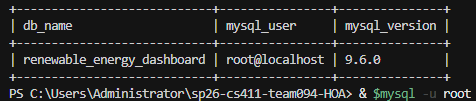

   `SHOW TABLES` in the same database (`show_tables.png`):

   > 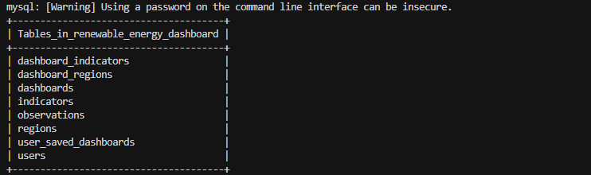

2. **Count screenshot for Table 1 (≥1000 rows)**

   `users` — `COUNT(*)` = 1200 (`count_table1.png`):

   > 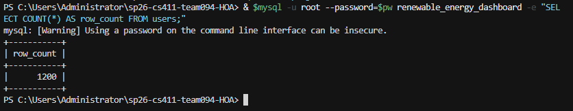

3. **Count screenshot for Table 2 (≥1000 rows)**

   Per-table counts including **`observations`** ≥ 1000 (`count_table2.png`). See also `count_all_tables.png`.

   > 

4. **Count screenshot for Table 3 (≥1000 rows)**

   Same count output, highlighting **`dashboard_regions`** ≥ 1000 (`count_table3.png`).

   > 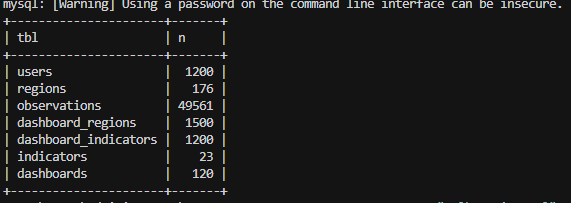

   Full multi-table count output (`count_all_tables.png`):

   > 

### Advanced queries

5. **Advanced Query 1 — top 15 rows**

   > 

6. **Advanced Query 2 — top 15 rows**

   > 

7. **Advanced Query 3 — top 15 rows**

   > 

### Indexing analysis — Query 1

8. **Query 1 — before experimental indexes**

   Baseline `EXPLAIN ANALYZE` (`q1_before.png`). Ensure no `idx_stage3_*` were present (see Step 6).

   > 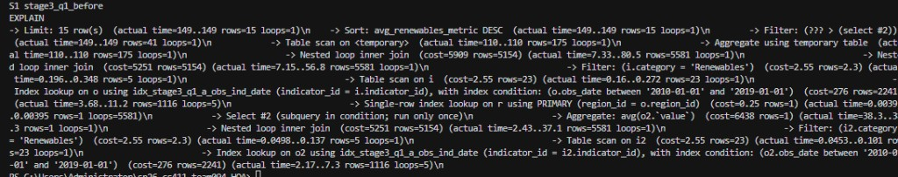

9. **Query 1 — Index Design 1** (`idx_stage3_q1_a_obs_ind_date`)

   > 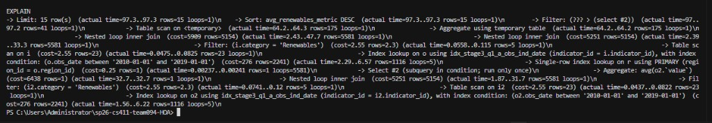

10. **Query 1 — Index Design 2** (`idx_stage3_q1_b_obs_date_ind`)

   > 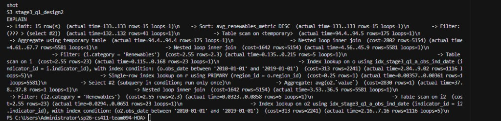

11. **Query 1 — Index Design 3** (`idx_stage3_q1_c_ind_cat_code` on `indicators`)

   > 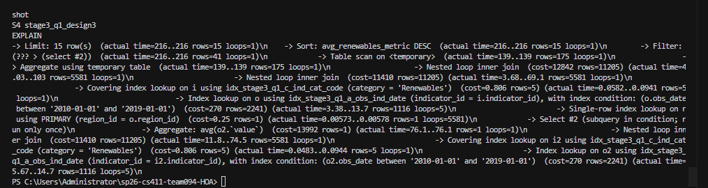

### Indexing analysis — Query 2

12. **Query 2 — before experimental indexes** (`q2_before.png`)

   > 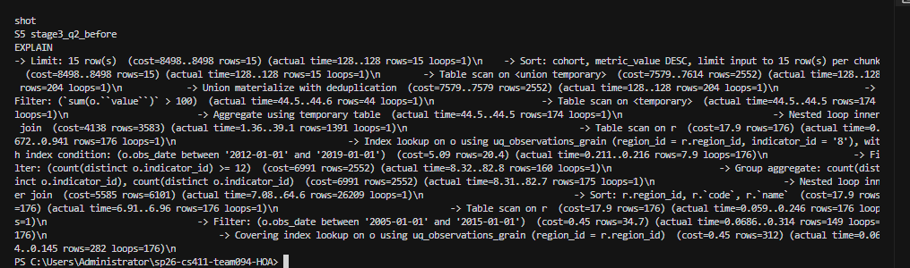

13. **Query 2 — Index Design 1** (`idx_stage3_q2_a_obs_ind_date`)

   > 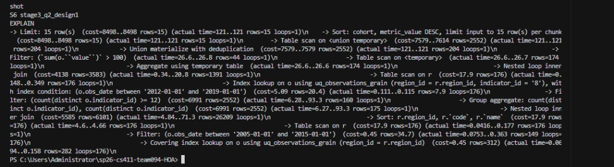

14. **Query 2 — Index Design 2** (`idx_stage3_q2_b_obs_reg_date`)

   > 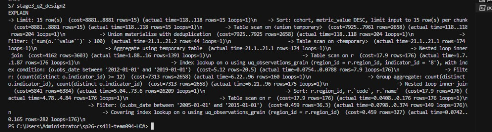

15. **Query 2 — Index Design 3** (`idx_stage3_q2_c_obs_date_reg`)

   > 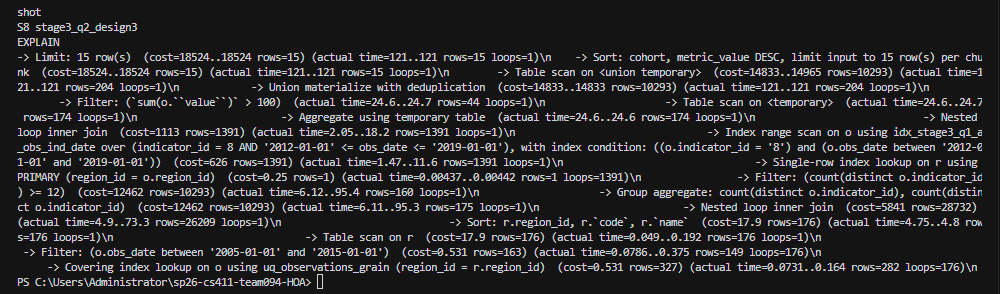

### Indexing analysis — Query 3

16. **Query 3 — before experimental indexes** (`q3_before.png`)

   > 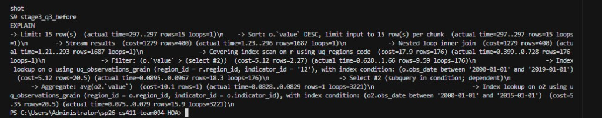

17. **Query 3 — Index Design 1** (`idx_stage3_q3_a_obs_reg_ind_date`)

   > 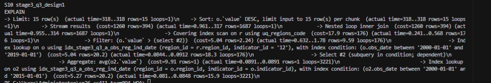

18. **Query 3 — Index Design 2** (`idx_stage3_q3_b_obs_date_reg_ind`)

   > 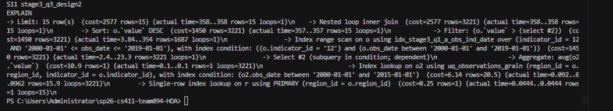

19. **Query 3 — Index Design 3** (`idx_stage3_q3_c_obs_ind_reg_date`)

   > 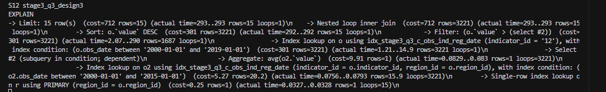

### Extra COUNT(*) captures (optional)

> 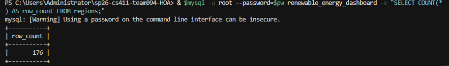

> 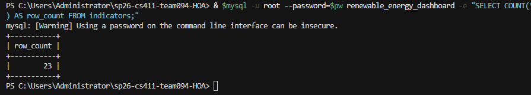

---

## Appendix — DDL (`CREATE TABLE` statements)

The following is the **exact** table DDL we use (same as `sql/schema.sql`). We implement **eight** tables; **five** central ones are `users`, `regions`, `indicators`, `observations`, and `dashboards`.

### `users`

```sql
CREATE TABLE users (
    user_id INT UNSIGNED AUTO_INCREMENT PRIMARY KEY,
    email VARCHAR(255) NOT NULL,
    display_name VARCHAR(120) NOT NULL,
    role ENUM('viewer', 'analyst', 'admin') NOT NULL DEFAULT 'viewer',
    created_at TIMESTAMP NOT NULL DEFAULT CURRENT_TIMESTAMP,
    CONSTRAINT uq_users_email UNIQUE (email)
) ENGINE=InnoDB DEFAULT CHARSET=utf8mb4 COLLATE=utf8mb4_unicode_ci;
```

### `regions`

```sql
CREATE TABLE regions (
    region_id INT UNSIGNED AUTO_INCREMENT PRIMARY KEY,
    code VARCHAR(64) NOT NULL,
    name VARCHAR(160) NOT NULL,
    country VARCHAR(120) NOT NULL,
    latitude DECIMAL(9,6) NULL,
    longitude DECIMAL(9,6) NULL,
    CONSTRAINT uq_regions_code UNIQUE (code)
) ENGINE=InnoDB DEFAULT CHARSET=utf8mb4 COLLATE=utf8mb4_unicode_ci;
```

### `indicators`

```sql
CREATE TABLE indicators (
    indicator_id INT UNSIGNED AUTO_INCREMENT PRIMARY KEY,
    code VARCHAR(48) NOT NULL,
    name VARCHAR(200) NOT NULL,
    unit VARCHAR(32) NOT NULL,
    category VARCHAR(64) NOT NULL,
    description VARCHAR(512) NULL,
    CONSTRAINT uq_indicators_code UNIQUE (code)
) ENGINE=InnoDB DEFAULT CHARSET=utf8mb4 COLLATE=utf8mb4_unicode_ci;
```

### `dashboards`

```sql
CREATE TABLE dashboards (
    dashboard_id INT UNSIGNED AUTO_INCREMENT PRIMARY KEY,
    owner_user_id INT UNSIGNED NOT NULL,
    title VARCHAR(200) NOT NULL,
    description VARCHAR(1000) NULL,
    is_public TINYINT(1) NOT NULL DEFAULT 0,
    created_at TIMESTAMP NOT NULL DEFAULT CURRENT_TIMESTAMP,
    updated_at TIMESTAMP NOT NULL DEFAULT CURRENT_TIMESTAMP ON UPDATE CURRENT_TIMESTAMP,
    CONSTRAINT fk_dashboards_owner
        FOREIGN KEY (owner_user_id) REFERENCES users (user_id)
        ON DELETE RESTRICT ON UPDATE CASCADE
) ENGINE=InnoDB DEFAULT CHARSET=utf8mb4 COLLATE=utf8mb4_unicode_ci;
```

### `observations`

```sql
CREATE TABLE observations (
    observation_id BIGINT UNSIGNED AUTO_INCREMENT PRIMARY KEY,
    region_id INT UNSIGNED NOT NULL,
    indicator_id INT UNSIGNED NOT NULL,
    obs_date DATE NOT NULL,
    value DECIMAL(18,6) NOT NULL,
    data_source VARCHAR(200) NULL,
    recorded_by_user_id INT UNSIGNED NULL,
    CONSTRAINT fk_observations_region
        FOREIGN KEY (region_id) REFERENCES regions (region_id)
        ON DELETE RESTRICT ON UPDATE CASCADE,
    CONSTRAINT fk_observations_indicator
        FOREIGN KEY (indicator_id) REFERENCES indicators (indicator_id)
        ON DELETE RESTRICT ON UPDATE CASCADE,
    CONSTRAINT fk_observations_recorded_by
        FOREIGN KEY (recorded_by_user_id) REFERENCES users (user_id)
        ON DELETE SET NULL ON UPDATE CASCADE,
    CONSTRAINT uq_observations_grain UNIQUE (region_id, indicator_id, obs_date)
) ENGINE=InnoDB DEFAULT CHARSET=utf8mb4 COLLATE=utf8mb4_unicode_ci;
```

### `user_saved_dashboards`

```sql
CREATE TABLE user_saved_dashboards (
    user_id INT UNSIGNED NOT NULL,
    dashboard_id INT UNSIGNED NOT NULL,
    saved_at TIMESTAMP NOT NULL DEFAULT CURRENT_TIMESTAMP,
    PRIMARY KEY (user_id, dashboard_id),
    CONSTRAINT fk_saved_user
        FOREIGN KEY (user_id) REFERENCES users (user_id)
        ON DELETE CASCADE ON UPDATE CASCADE,
    CONSTRAINT fk_saved_dashboard
        FOREIGN KEY (dashboard_id) REFERENCES dashboards (dashboard_id)
        ON DELETE CASCADE ON UPDATE CASCADE
) ENGINE=InnoDB DEFAULT CHARSET=utf8mb4 COLLATE=utf8mb4_unicode_ci;
```

### `dashboard_regions`

```sql
CREATE TABLE dashboard_regions (
    dashboard_id INT UNSIGNED NOT NULL,
    region_id INT UNSIGNED NOT NULL,
    PRIMARY KEY (dashboard_id, region_id),
    CONSTRAINT fk_dr_dashboard
        FOREIGN KEY (dashboard_id) REFERENCES dashboards (dashboard_id)
        ON DELETE CASCADE ON UPDATE CASCADE,
    CONSTRAINT fk_dr_region
        FOREIGN KEY (region_id) REFERENCES regions (region_id)
        ON DELETE RESTRICT ON UPDATE CASCADE
) ENGINE=InnoDB DEFAULT CHARSET=utf8mb4 COLLATE=utf8mb4_unicode_ci;
```

### `dashboard_indicators`

```sql
CREATE TABLE dashboard_indicators (
    dashboard_id INT UNSIGNED NOT NULL,
    indicator_id INT UNSIGNED NOT NULL,
    PRIMARY KEY (dashboard_id, indicator_id),
    CONSTRAINT fk_di_dashboard
        FOREIGN KEY (dashboard_id) REFERENCES dashboards (dashboard_id)
        ON DELETE CASCADE ON UPDATE CASCADE,
    CONSTRAINT fk_di_indicator
        FOREIGN KEY (indicator_id) REFERENCES indicators (indicator_id)
        ON DELETE RESTRICT ON UPDATE CASCADE
) ENGINE=InnoDB DEFAULT CHARSET=utf8mb4 COLLATE=utf8mb4_unicode_ci;
```
